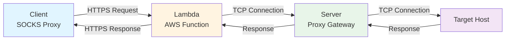
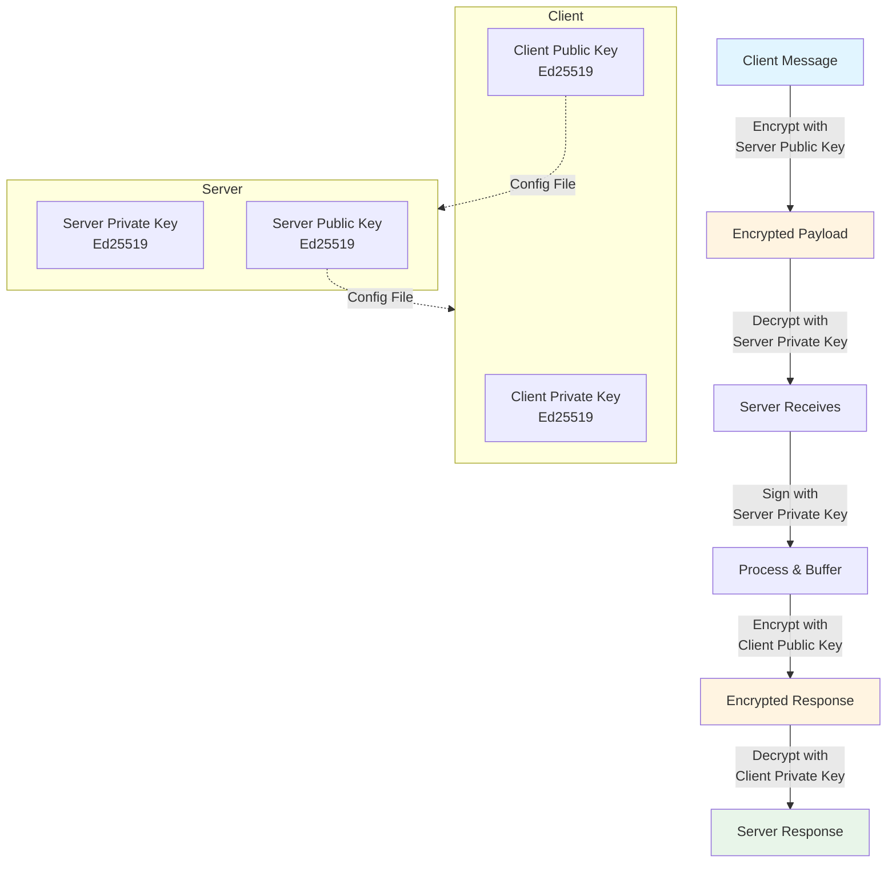
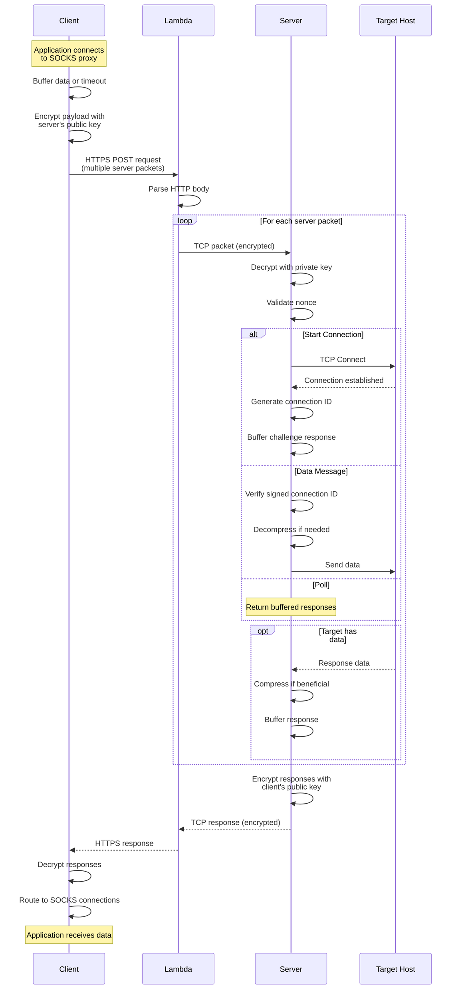
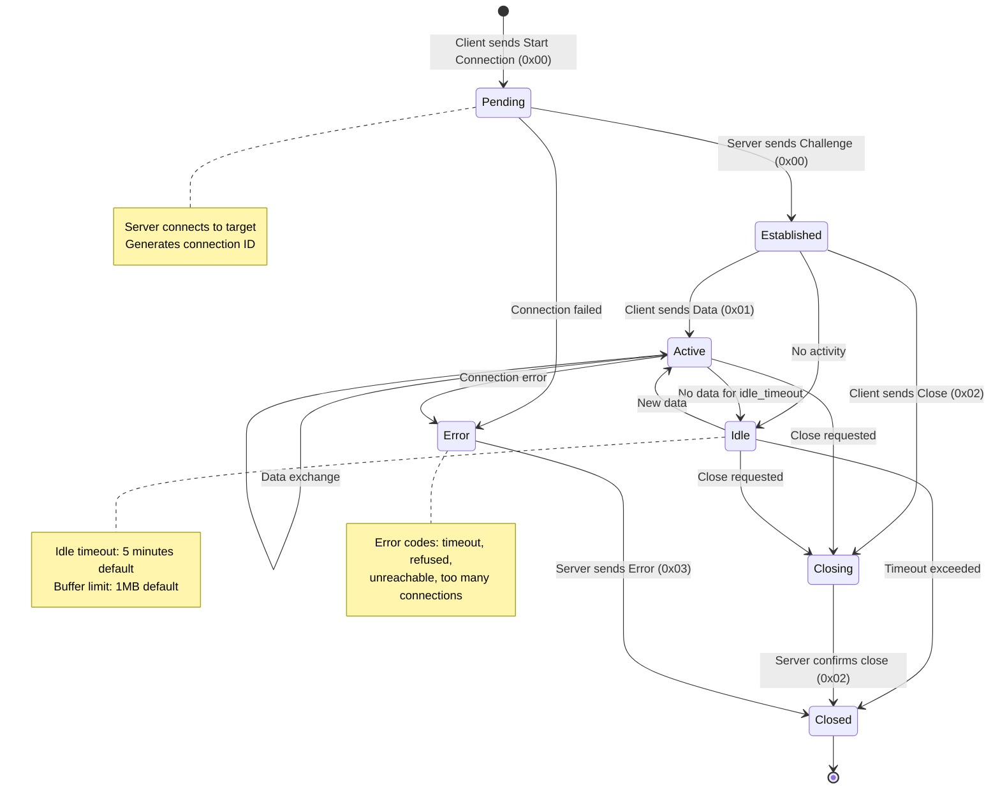

# Censorless-ng Design

## Architecture Overview

Censorless-ng is a censorship-resistant proxy system composed of 3 components that work together to route traffic through AWS Lambda functions.



### Encryption Model



**Security Properties:**

- **Authentication**: Client and server authenticate using Ed25519 public keys configured out-of-band
- **Replay Protection**: Monotonically increasing nonce prevents replay attacks
- **Connection Ownership**: Signed connection IDs prove client owns a connection
- **Confidentiality**: All payloads encrypted with recipient's public key

**Note:** Current implementation uses Ed25519 for encryption. Future versions should migrate to X25519 ECDH + ChaCha20Poly1305 for proper key exchange and forward secrecy.

## System Components

### Client
The client is a SOCKS proxy that forwards packets to the lambda. The client takes a configuration file that looks like this
```toml
private_key = "<ed25519 private key goes here>"
lambda = "http://amazonlambdaurl.goes.here"
lambda_buffer = 1048576 # If a pending lambda packet is of this size or greater, send it immediately
timeout = 1000 # milliseconds to wait for more packet data before sending a lambda request, regardless of how much data is in the buffer
idle_timeout = 300000 # milliseconds of inactivity before closing a connection (default 5 minutes)
[[servers]]
public_key = "<ed25519 public key of the server>"
host = "ipv4, ipv6, or hostname"
port = 1337
```

Packets are sent to the lambda as HTTP request bodies using reqwest. For a lambda, they must be sent all at once.

#### Client-to-Lambda Packet Format

All multi-byte integers are sent in **little-endian** format. The packet may contain multiple server destinations.

**Outer Packet Structure (repeated for each destination server):**

| Field | Type | Description |
|-------|------|-------------|
| Server Address | Variable | SOCKS address format (see below) |
| Server Port | u16 | Target server port |
| Payload Length | u32 | Length of encrypted payload (0 if no payload) |
| Encrypted Payload | Variable | Encrypted with server's public key (optional if length=0) |

**SOCKS Address Format:**

| Type Byte | Format | Description |
|-----------|--------|-------------|
| 0x01 | 1 + 4 bytes | IPv4 address |
| 0x03 | 1 + 1 + N bytes | Domain name (length-prefixed) |
| 0x04 | 1 + 16 bytes | IPv6 address |

**Encrypted Payload Structure:**

| Field | Type | Description |
|-------|------|-------------|
| Client Public Key | 32 bytes | Ed25519 public key |
| Nonce | u64 | Monotonically increasing counter (replay protection) |
| Messages | Variable | One or more messages (see below) |

**Message Types (repeated within encrypted payload):**

Each message starts with a type byte followed by type-specific payload:

##### 0x00: Start Connection

| Field | Type | Description |
|-------|------|-------------|
| Type | u8 | 0x00 |
| Target Address | Variable | SOCKS address format |
| Target Port | u16 | Destination port |

##### 0x01: Data

| Field | Type | Description |
|-------|------|-------------|
| Type | u8 | 0x01 |
| Signed Connection ID Length | u8 | Length of following signature |
| Signed Connection ID | Variable | Signature of (address + port + connection_id) |
| Compression Flag | u8 | 0x00=uncompressed, 0x01=zstd |
| Original Length | u32 | Uncompressed data length |
| Actual Length | u32 | Wire length (post-compression) |
| Data | Variable | Payload (possibly compressed) |

##### 0x02: Close Connection

| Field | Type | Description |
|-------|------|-------------|
| Type | u8 | 0x02 |
| Signed Connection ID Length | u8 | Length of following signature |
| Signed Connection ID | Variable | Signature of (address + port + connection_id) |

##### 0x03: Poll

| Field | Type | Description |
|-------|------|-------------|
| Type | u8 | 0x03 |

No additional payload. Requests pending server responses without sending new data.

### Lambda
The lambda accepts HTTP(s) requests from the client, parses the payload into messages, and sends each message to the target servers over TCP.
The lambda takes in configuration options from the lambda context
```
# if specified, the lambda will only accept requests from clients whose public keys are in this list
client_whitelist, optional: a list of ed25519 public keys
# if specified, the lambda will not connect to any host that is not in the whitelist. this allows for saving costs, such as using an Amazon EC2 instance to eliminate egress bandwidth
server_whitelist, optional: a list of
    host="ipv4, ipv6, or domain name"
    port = 1337
    public_key="<ed25519 public key of the server>"
timeout: milliseconds to wait for connecting to the server (default: 5000)
read_timeout: milliseconds to wait after sending packets to the server to receive a response (default: 7000). Should be set larger than the server's read_timeout plus network overhead. If no response is received after this amount of time, the connection is closed. Once all connections are closed, the lambda terminates
```


### Server
config:
```toml
private_key = "<ed25519 private key>"
port = 1337
addr = "0.0.0.0" # same as usual, v4, v6, or host
buffer_max = 1048576 # Bytes from the host the server is communicating with to receive before our buffer fills and we decide to abandon the connection
timeout = 5000 # ms to wait for a lambda connection before closing it
read_timeout = 1000 # ms to wait for target response after writing data (default: 1000)
poll_timeout = 500 # ms to wait for target data during poll operations (default: 500)
idle_timeout = 300000 # milliseconds of inactivity on a proxied connection before closing it (default 5 minutes)
connections_per_pkey = 100 # maximum number of concurrent connections allowed per client public key
allow_private = false # Allow connections to private IPs (for local testing only, never enable in production)
```
The server receives TCP packets from the lambdas. First, it decrypts the payload using its private key. Then, it validates the incrementing nonce for the public key it was given. Next, it either initiates connections or ferries data between the client (via the lambda's connections) or the target.

The server buffers responses for each client (identified by public key) until the client requests them via another lambda invocation. Buffered responses are subject to the buffer_max and timeout constraints. Connection IDs are generated using an atomic global incrementer to ensure uniqueness.

#### Connection Cleanup

The server implements several mechanisms to manage connection lifecycles:

- **Idle Timeout**: Connections inactive for longer than `idle_timeout` are automatically closed
- **Buffer Overflow Protection**: Connections closed if target sends more than `buffer_max` bytes without client acknowledgment
- **Periodic Cleanup**: Background task runs every 60 seconds to remove stale connections
- **Rate Limiting**: Each client public key is limited to `connections_per_pkey` concurrent connections

#### SSRF Prevention

The server filters private IP ranges to prevent Server-Side Request Forgery (SSRF) attacks. Connection attempts to the following addresses are rejected with error code 0x03 (host unreachable):

**Blocked IP Ranges:**

| Category | IPv4 | IPv6 |
|----------|------|------|
| Loopback | 127.0.0.0/8 | ::1 |
| Private Networks | 10.0.0.0/8<br/>172.16.0.0/12<br/>192.168.0.0/16 | fc00::/7 (Unique Local) |
| Link-Local | 169.254.0.0/16 | fe80::/10 |
| Multicast | 224.0.0.0/4 | ff00::/8 |
| Broadcast | 255.255.255.255 | N/A |
| Documentation | 192.0.2.0/24<br/>198.51.100.0/24<br/>203.0.113.0/24 | 2001:db8::/32 |
| Unspecified | 0.0.0.0 | :: |

**Domain Name Handling:** When a domain name is provided, DNS resolution is performed and **all** resolved IP addresses are checked. If any resolved address falls within a blocked range, the connection is rejected.

**Testing Override:** SSRF protection can be disabled for local testing by setting `allow_private = true` in the server config file or using the `--allow-private` CLI flag. This should **never** be enabled in production environments.

## Message Flow



## Protocol Specifications

### Server-to-Client Response Format

All responses are encrypted using the client's public key. Multiple response messages may be included in a single encrypted payload.

**Encrypted Response Structure:**

| Field | Type | Description |
|-------|------|-------------|
| Messages | Variable | One or more response messages (see below) |

**Response Message Types:**

Each message starts with a type byte followed by type-specific payload:

##### 0x00: Challenge (Connection Established)

| Field | Type | Description |
|-------|------|-------------|
| Type | u8 | 0x00 |
| Connection ID | u64 | Unique identifier for this connection |

The client must sign this connection ID in subsequent data/close messages to prove ownership.

##### 0x01: Data

| Field | Type | Description |
|-------|------|-------------|
| Type | u8 | 0x01 |
| Connection ID | u64 | Connection identifier |
| Compression Flag | u8 | 0x00=uncompressed, 0x01=zstd |
| Original Length | u32 | Uncompressed data length |
| Actual Length | u32 | Wire length (post-compression) |
| Data | Variable | Payload from target (possibly compressed) |

##### 0x02: Close Connection

| Field | Type | Description |
|-------|------|-------------|
| Type | u8 | 0x02 |
| Connection ID | u64 | Connection identifier |
| Message Length | u32 | Error message length (0 for normal close) |
| Message | Variable | UTF-8 error description (if length > 0) |

##### 0x03: Error

| Field | Type | Description |
|-------|------|-------------|
| Type | u8 | 0x03 |
| Connection ID | u64 | Connection identifier (0 if error before establishment) |
| Error Code | u8 | Error type (see table below) |
| Message Length | u32 | Error description length |
| Message | Variable | UTF-8 error details |

**Error Codes:**

| Code | Name | Description |
|------|------|-------------|
| 0x01 | Timeout | Connection timeout to target host |
| 0x02 | Connection Refused | Target refused connection |
| 0x03 | Host Unreachable | Cannot reach host (includes SSRF blocks) |
| 0x04 | Too Many Connections | Client exceeded `connections_per_pkey` limit |
| 0xFF | Unknown Error | Generic error condition |

**Note:** Connection ID 0 is reserved for error responses that occur before a connection is successfully established.

## Connection Lifecycle



### Connection Management Rules

- **Idle Timeout**: Connections idle for longer than `idle_timeout` (default 5 minutes) are automatically closed
- **Buffer Limit**: If target sends more than `buffer_max` bytes (default 1MB) without client reading, connection is closed
- **Connection Limit**: Each client public key is limited to `connections_per_pkey` concurrent connections (default 100)
- **Cleanup Task**: Periodic cleanup runs every 60 seconds to remove stale connections
- **Connection ID**: Generated using atomic global incrementer; ID 0 is reserved for pre-establishment errors

## Compression

Data compression using zstd is optional for both client→server and server→client data messages:
- Compression is indicated by the compression_flag byte (0x00=uncompressed, 0x01=zstd)
- Compression is recommended for data larger than 128 bytes to avoid overhead
- The original_length field represents the uncompressed data length
- The actual_length field represents the wire length (after compression if compressed)
- Compression can reduce bandwidth usage by 30-60% for text-based protocols (HTTP, SSH, etc.)

## TODOs / Planned Improvements

### Rate Limiting
Currently there is no rate limiting on the server or lambda. Future improvements could include:
- Request rate limiting per client public key on the server
- Lambda invocation rate limiting per client
- Bandwidth throttling per client
- Connection attempt rate limiting

### Protocol Optimizations
- **Batch acknowledgments**: Allow clients to acknowledge multiple data messages at once instead of per-message
- **Keepalive/heartbeat**: Add explicit keepalive messages to maintain connections through restrictive NATs/firewalls

### Security Enhancements
- **Proper key exchange**: Replace Ed25519-based encryption with X25519 ECDH + ChaCha20Poly1305 for proper key exchange
